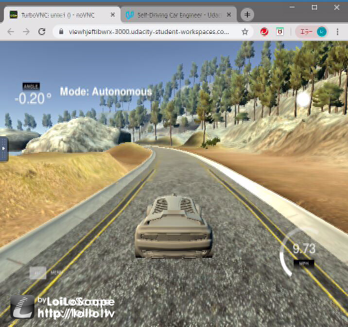
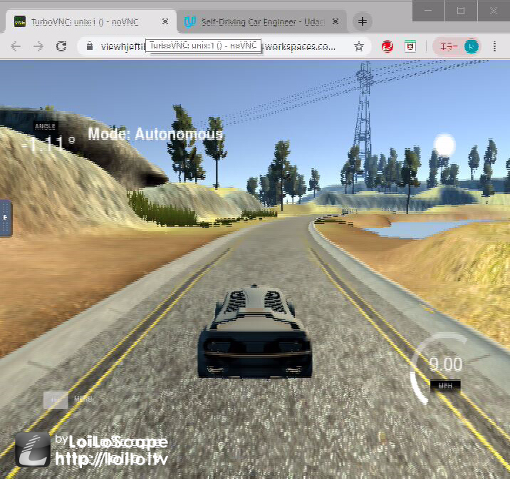
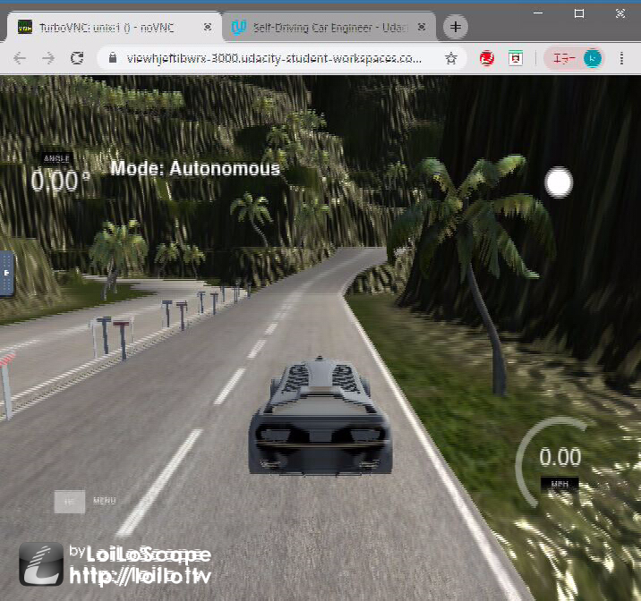
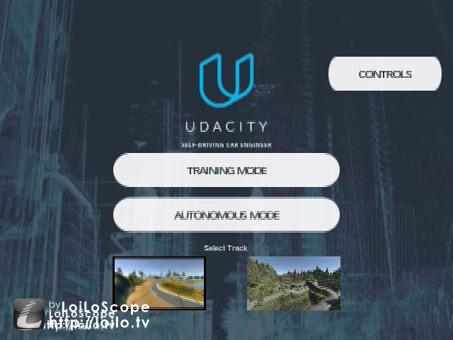
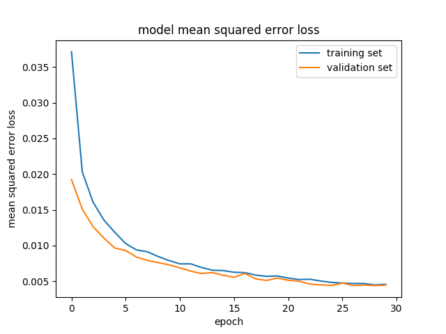
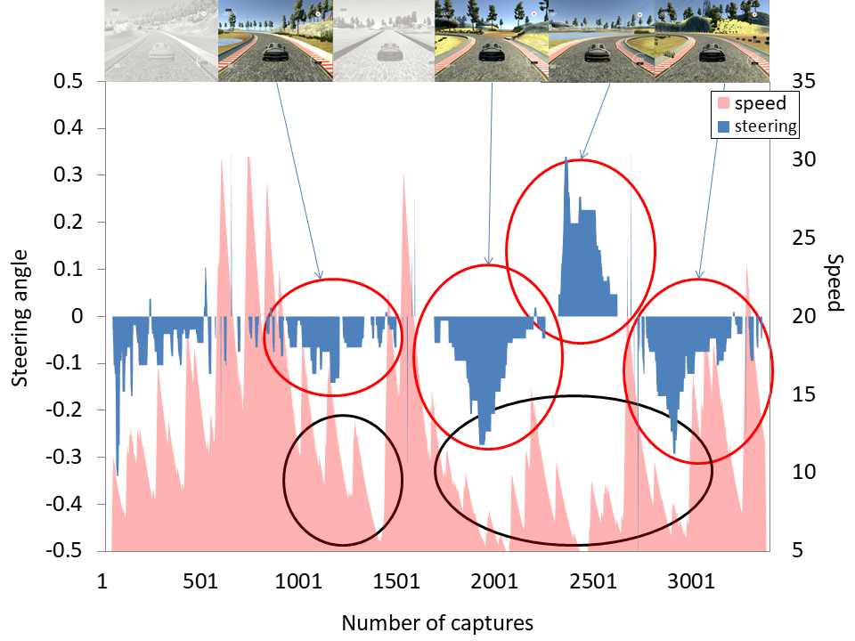
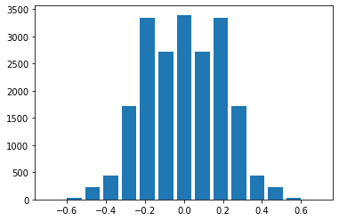

# Behavioral Cloning Project

|Autonomous driving|Autonomous driving|Autonomous driving|Manual operation|
|:--------:|:--------:|:------------:|:------------:|
|Lake Track|Lake Track[reverse]|Jungle Track|Lake Track|
|[](https://youtu.be/LtLwOluTLsU)|[](https://youtu.be/0FS8mlMxdaE)|[](https://youtu.be/j9Qjt5cCKHw)|[](https://youtu.be/AQOjGxCRZ2Q)|
|[YouTube Link](https://youtu.be/LtLwOluTLsU)|[YouTube Link](https://youtu.be/0FS8mlMxdaE)|[YouTube Link](https://youtu.be/j9Qjt5cCKHw)|[YouTube Link](https://youtu.be/AQOjGxCRZ2Q)|

In this project, I use a neural network to clone car driving behavior. It is a supervised regression problem between the car steering angles and the road images in front of a car.  
## Project Description
### The goals / steps of this project are the following:
- Build, a convolution neural network in Keras that predicts steering angles from images
- Train and validate the model with a training and validation set
- Test that the model successfully drives around track one without leaving the road
- Summarize the results with a written report  
### Files included
`model.py` : The script used to create and train the model  
`drive.py` : The script to drive the car in autonomous mode  
`model.h5` : The script to provide useful functionalities (i.e. image preprocessing and augumentation)  
`writeup_report.md` : Summarize the results   
### Getting started
Additionally you need to download and unpack the [Udacity self-driving car simulator (Version 2)](https://github.com/udacity/self-driving-car-sim).    
### Run the pretrained model
To run the code start the simulator in `autonomous mode`, Then, run the model as follows:  
```sh
python drive.py model.h5
```

### To train the model
first make a directory ./data/, drive the car in training mode around the track and save the data to this directory.   
Then, run the model as follows:
```sh
python model.py
```
## Model Architecture and Training Strategy
### Model architecture
I used the NVIDIA's CNN model introduced in the Udacity lesson.   
   
 
|Layer (type)          |       Output Shape         |     Param     |  
|----------------------|:--------------------------:|:-------------:|  
|lambda_1 (Lambda)     |       (None, 68, 204, 3)   |     0         |  
|conv2d_1 (Conv2D)     |       (None, 32, 100, 24)  |     1824      |
|conv2d_2 (Conv2D)     |       (None, 14, 48, 36)   |     21636     | 
|conv2d_3 (Conv2D)     |       (None, 5, 22, 48)    |     43248     |
|conv2d_4 (Conv2D)     |       (None, 3, 20, 64)    |     27712     |
|conv2d_5 (Conv2D)     |       (None, 1, 18, 64)    |     36928     |
|dropout_1 (Dropout)   |       (None, 1, 18, 64)    |     0         |
|flatten_1 (Flatten)   |       (None, 1152)         |     0         |
|dense_1 (Dense)       |       (None, 100)          |     115300    |    
|dense_2 (Dense)       |       (None, 50)           |     5050      |   
|dense_3 (Dense)       |       (None, 10)           |     510       |
|dense_4 (Dense)       |       (None, 1)            |     11        | 

Total params: 252,219 / Trainable params: 252,219

### Data Preprocessing  
First, read images and steering angles, which are the dataset provided from Udacity, from the csv file.  
1. Then converted the color space from BGR into RGB for drive.py, cropped top 50[pixel] and bottom 20[pixel] (160x320x3 => 90x320x3)
2. And resized to 68x204 (90x320x3 => 68x204x3) in order to feed to the NVIDIA's CNN architecture.

### Model Training
I used the following augumentation for training.
- For left image, steering angle is adjusted by +0.2
- For right image, steering angle is adjusted by -0.2
- Addition fliped image left/right

### Training, Validation and Test
<br/>
I used Adam optimizer for optimization with learning rate of 1.0e-4 because default rate = 1.0e-3 is too big.
I confirmed the operation of epochs from 3 to 30, but none of them was a problem, but this time we uploaded epoch 30 data.

### For your information
The training data was manipulated with the following 2 points.  
As a result, the run was successful with only one round of learning data.  

1. Smooth steering　/ Swivel turn speed
<br/>

2. Driving where the steering angle is leveled
(Eliminate sudden steering and maximize steering angle 0)
<br/>


